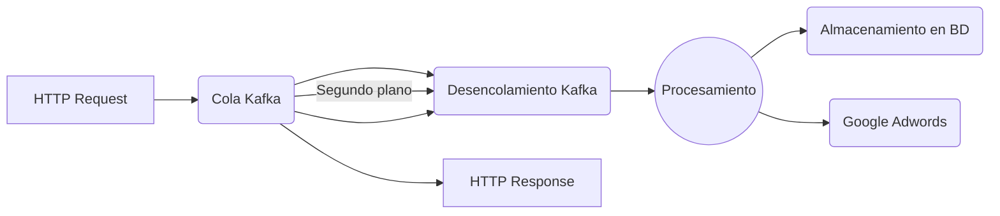

# Vendor Campaign Creator

Este microservicio extrae tiendas y su información básica, después crea las campañas necesarias dentro de Google Adwords. Cada campaña incluye _ad groups_, anuncios, palabras clave y ubicaciones.

## Prerequisitos

1.  Docker
2.  Python 3.7
3.  Usuario de snowflake
4.  Acceso a Google Adwords

## Tecnologías

-   Python
-   PostgreSQL

## ¿Cómo funciona?

El ms recibe las peticiónes a base de una cola en Kafka. Esta cola es después procesada por las diferentes instancias, de esta forma evitando un desbordamiento y exceso de uso en los recursos.

![Kafka messaging queue](data:image/png;base64,iVBORw0KGgoAAAANSUhEUgAAATkAAAChCAMAAACLfThZAAAAt1BMVEX////P4vPT5vcAAAC2yNiopqXI2+yNi4nR5fZ6hY9pcnutvcuYl5WpuceSoKyWpLGBg4WzsbCdnJvB1OW5uLd3en1cZ3Du7u74+PjV1dXj4+NocHd/fXyBjZjs7OyltcLIyMhxd3xsbGzMzMxjY2O1tbVJSUl0dHSRkZE6OjpCQkIoKChVVVVmZmYMDAxOTk4aGhojIyMxMTE/RUpTW2Ld8f8yNztLU1kVFRVYYGc4PUIqLjF/i5XawFlOAAAN4klEQVR4nO2diWKiOhSGA2ETKLJdSVJUqii4t1q7TPv+z3UTUFsVd1q18s/Y2ogSPrPnnAMAhQoVKlSoUKFC16u4+ygjEInZr7oh/eEN+hg0+z7a6wO9qNOz88vfxcqCtggj8Bhnv2xD+oNAaAMftvcihx6fRB2GOWbxQqVDF+AA9BpjGAC3B0ce7oZj1IBtWsw6T4OE3NvTGAyf2oB0oE9LIBy7IIAwRMiHjyKo9aDcJWhEE+jBLiQAtCDRGwD3EOrD0EPjFohC0GRfwN8RakPYr4HxGA+6IBY9aGEYuSL0/JE3HpBxWuZiSKDc9joRGYoWxJaOYOT5pBaSGIJ+m4SQvt3r+PRgmb0DQ2x2KF0UtWujEFBi/S6AOoH4zJeboxDBdq8HnmJg9xCJ2owcAX3YaMMmvc5ZbXVh2BXbGI4ajyGBw7ZLK+/YrwEr7EIAZXoEfuo2Oh1a6OIZOblLyXldVpgBFEE4wrDdgPq5rzc/NfpJMekxcmQYo5Rc1PWwS2Ar5UBgMICx2CXQqrm41rRCSHBThCYtfi7lEgER4p7sBU3AoLk4bAw9c8jKXCf0goCR61NyAXHJua83PwWwHdLGayiD+I0MQx/GjFwA5fEANGDjKSXX1GEg0tZvHMPAgvGg4/U6NqQVVw4hEmG/A4kN9bQZG8A+hA0K0+xAZENz6IPHTgS7YNz2/1JtBTiOA9qkY0BoV2EGAfYsD4CmKSKAbLFp0UNQq1YTEX0dWSY9NpD1GvBEk/0tE8sjrhtQ2q7vpp1vINtuzwKiTiwEArMFQE1uBS59i/6HilweimA86qwm7jf2u3EhS2TFtFChQoUKFSp0YwrMTTp3zi5dupQtTj13zi5dOpctviC3QwW5Y1WQO1YFuWNVkDtWc3IKrxTkDlJKTuG0ssN+O05Bbk8l5BThdaI+VXlF+mfwBbn9lJDjX6tTXppIQu+jILev7KSOPkkMluJIakFuT7l9hZH7SGAxXgW5vdR8a/usS5VeNJ7jq05Bbk8RP/DsBFOpIvH1F6kgt58C2VuM5+4nzxNNoQjLBbmdshMbtxk53nEkxkySivHcDnlRallQzL4OVBDNds0LcodJX5hPbSEn2psVnDHzZxQJv2yAtpBTnc26zV0KK/pm37KFXInf8BqnSLdIDi3bjev8Bm0jx90iOdxYttZzH/7LVlSQW5Ll729gVZD7EjI3eHhkqiC3EGkcZFdbkJvLahxmM5qQU5Lugj7h+ZslF1kHvoGRUxxIZVCAi1WUWyOH+wdbwKfkJjznQEFSYfk2ydlHeKvMyE35KRQE4/4mySHfPeJds9paKn08S8q0slRbG7nn8SKFG0e5XKTk3uplTVI4fokc9xHknMeLlKUf54eRkvs3TXb/l8lJ5p5+vdcsJB/ap86VkntJga2Sw3/JtzRTJDraOSodCQupvcmX3cSshzD/uNOVeEInmJKbG+osGexQcuRvd6+N4IQ375h9iad89oULN07yPNs1b/0jYQnC+zVNTvTV3kXOPbbruSxlXOZD/h+5RO6PFLpfJTfbh6j9iQAEP0BOlTZufQn/JUf4tdMzfnb9ADlb36x0HowGp2f87JoNvhSOz43cHvoLO9YJOUkQOPVO+T1y4MBl5ktUMsmsqKWy9qvkmtc/fU3KXFXTyne/Sg7IVz99TWtr8v8X2znwB6avP9C37if92iP8nI0cin7lND+ns5EDwSF2Axeo85EDV17oSryyIu7+l0593Z2E7K/r14Za0fVOX2uDs46q0NXuvgbnbmmudWE9Pv/a7FUWOmI2z50FWurP/+UdrMC8iNWKA4xoL0MovpBhKN4Q7vtS5R1mvvqTii8mJ/vIuqCG2Vv078gSL0ru+mizkUdN1d8r2Xo58INaMxM9V9WEi1JZlZdzisNcRr9bfHAOVNpJYHVtGriujNMdms6n6UuP5FfGycpLdpdWTn1qfl6a6cL6f46y4RO/JN2ty9mS7mSkMxMrRas7nHYnSXca59QF9qckZJ2+/ZVL5Oc1gMrRvzWxC3vYDU4R1PKqjCrPKfXSWnrV4Dm+XF1LL7+zSBeVssaVy45jlDnNqPN1Q5AqGdvrfGWRx1XnrcsgV2Mjky0mFV/kymt1z0nIaWvpWkJOWK+rauqjoSR+GvTB4krRh1TeSk7McfSbp0+1jfcmt5aUkLtbLbDKjNx6QWbk+AxMWadfkIvyXD7K1Rs9/GVy6vrJqpvLHGnnuqI0jx3BakDiqnQKObd1ODk+m1yakXVy8wwm5L5jSg+R7jeSE3NeUUrJ8WUInwXeeZ/Mv8bjIiCEB5BLBhD0zNIKuTT9M6GyRI4NMaTPqrIgN6uadODBKVI9Sc/sWxk55Af5gpvFAqv+c/jqhzQx+M/ZpR9HDtt7k1OcskC7hPpwhRx9VagL9XpVU5bJOXdC3SnX66mNfFLmkpPR8QjtXicPaSGVMk5IyeHjDc2zL5Sk5KSJwDLo1B0+6e6PJgfkrFFBJjleLb8a71zpfYUc/1yflCu88OEsk+NftUld5fiHtFR9tXOvdy/avaTNau5DVm29d1nXkHSrXq1G/1N5hAknai4UMLWYdNu22cMW/YjKjKmiBpVvmqb8BEM/+ZqTL5517dLHrLgfSY5ktTPZ5O6de0etGrCuLJOjNKWSxGmf/DK5f1OVV7l5+CMGTWFvlV6nn9MKJ3wm6dntnArpZcuJkvDciSFb8tSmk2wrCS9iJdDwQmRZNW+u5AuQrTSilfNPYtWH44XnEyNaxfuXOcrNUTnn1VkhpzJyQkmtr5Y5yqdk3Je/ylxiCiI9T0v8s+Sk5LjMdk4NfsD8Je0hnunYVHpxhBdtqpxCrqnv384JnMM5iuKkSV89hJP8E4TVHsJh76AzeGdR5tLaStPph8y6BmVDD+FFYt4rwLM4m0/V+qSivEyqJe2U2jo6pG9dSlodlSgpiKVRiZL0r9wXuVmjpix+bBmV4JN8QzaR4+jsp1TnpbJhGHcnkBODTeR4OnKYx93NbSTMOWvJW8ZzQBzkui88n0Pw6fyP50+orV5j0xyCN7SSo86LTl7zVoVFakynrLMZrMJnnX4++0JRnmv+ec6+2F7/XrX1nhXuJVUTcg+ryUYpIfe5lm68si96IjmGIWlGWSkbGmcYjmBsmX1R4UFwieSabI16D3KcpK3L2ZAubUhP1+ck+hLn0D/YB9zdsdHyhjnEXGJungj5kUsN6bJGomvKWCY+NH3eKyjpQ/l6up0cIKZ1aWvCdrJmaO6xJvzLUlaiDgR+Lnv7eua3xOKTHPhBON0nYfsQv41mu3ipsjoMts0cNtb1TQ5Kld3vXdI8qJ2lChturXMm1d/XixgJT9+NwPqGeJAHbklarUWuRPmSFGcHHAnCC9lar/nnzsGhQrp8ERY51+hQQhoXYIHVvBDDoAPlnt8u51q9NVEcn9fG2b4A48cjhXPb8z9GXh7dwx4jLO9HmnTXP18bPTj9ipphr483ORoHSbwAMhj3f8RRAclHBq46WTlE30BvNdB8RH4r89UgaUZhALzwZ5xWcl/13E+on8NnQFpjMDBDCDEQ3+AA2G1IrLdHC5DxMGRrCTr74Y1rcRO4MrC6QxuYAcAmcCE8vWe38l313E+5DOWaPRgRYEYg6DPrzxDHA4BDAEaEVmKfzdjlBE8fywFo+aQLQLs2CFgYoDcAxqcPLjz5173Dc7GtRggga+iZLYD7oNkI35qxBdy3UbsXQFpbGTk9ubJuQs4M4Kg9dGkdwxF7+pjHcPLXq2wu9vx4TH/0A0YuxJ0a6DdjkY5TEWrWHlFKjkCAxKCDaBW1zCCkL3lRANwIj9hROeSBrXr+Zi9rHRPBc12Dvuh3mT0lHpEnbMMmrZy1jtsaeyJFmayvxW2xD3Vgh+7YRG0xeESttjuKQIc+zemKa2bue4tbzpXP56AgtjxAagBhgPUm9giF4dk2LdAtG6fNGNYt4mNgifRvT9RpObNswp6K+bXuTVqOf0dnHEX+kGw5h+YHbdbsiGv3RM8SOX0+9k/drJkV39+Io7aqk1c9P6dZfgiJuLR5+7NRSvXToibtjNxHzu2R/HNCg1Oq7E5y/YtYjv4hBSeseu4iF+QzlLtUIfHoXnYHOe+CPB1/RnjD2s1O7SAX/9Xu4Zvc6Kgqm5KbW4atxrC+Ni/q44TkY/YW08BslUqFmYPzWl1ZIvfn6+pMpH94cz6L1S9oZSjxxvLdXGLxejdtDpXVOHRevLg/xBRqgvq8ZKI6uYm6OhMy5d0Hfdfsbi71cvVR4vj7pftDjK4tysZpIo31Kkta7gbNyVXeH5zVu7nczB2EFrLW3J/0DE9vJu39695LrG+9dXKgJtvLvay+KUiBOm/nsu/mcqb8n1NBtNQr7rrzrTMz9uYNbXlUcoNC4vfFoZ33DF64Cn8fCt8mObbq+bW3eNTdlm+WHJ3LdufzsYLcodJnwTHn5BT+m99ZQW6ban6y+5KSU7i64fAc7wiSUpDbqWaEmzMvTeff8/2HwRsv6sf3MrcxsNKNkwPIhy0xIVep8rzwIpWE6cN8FKKCipDhb5Xq7r9z5/3Mkh9hmAzaXtj8yqEjkPrLl2dwy9qss1smn1sEh4kX/VsCi1Ok+xMjINyQkggI0oSVubrEKdPy60lRN25IaaSX0sOU16DzIkyN0+KV3JBm47n34QTW+Tv4703iCnJ7aR7RSnKYG7zinOLHf1vKNYraTakgd6wKcseqIHesCnLHKr9IzLcmu5Stz8n/1UtH8/8J5fEAAAAASUVORK5CYII=)
Gracias al sistema de encolamiento de Kafka cada mensaje puede ser procesado de forma paralela. Buscando la información de cada tienda y cargando los datos necesarios dentro de la plataforma de Google Adwords.

## Instalación

### Creando un usuario de Snowflake

Es importante contar con el acceso a Snowflake primero. Para hacer esto, debes de levantar dos tickets llenando el siguiente formulario: _[link]() esto le dará acceso a tu usuario de Rappi a Snowflake._ [link]() esto habilitará el SSO para tu usuario de Rappi en Snowflake.

### Variables de entorno

##### Google Credentials

-   GOOGLE_PRIVATE_KEY
-   GOOGLE_CLIENT_EMAIL
-   GOOGLE_TOKEN_URI
-   GOOGLE_ADWORDS_DEVELOPER_TOKEN
-   GOOGLE_ADWORDS_CLIENT_ID
-   GOOGLE_ADWORDS_CLIENT_SECRET
-   GOOGLE_ADWORDS_REFRESH_TOKEN
-   GOOGLE_ADWORDS_LOGIN_CUSTOMER_ID
-   GOOGLE_ADWORDS_API_ENABLED_BY_COUNTRIES=UY,EC,CR,CL,AR,PE,MX,BR,CO //  _Possible values: List of countries where you want to create campaigns_
-   GOOGLE_HEADLINE_LINE_LIMIT=30
-   GOOGLE_DESCRIPTION_LINE_LIMIT=90
-   GOOGLE_PATH_LINE_LIMIT=15
-   BUDGET_BIDDING_INPUT_DIR_ID

##### PG Credentials (valores para pruebas locales)

-   DB_GROWTH_SEM_AUTOMATION_USER=postgres
-   DB_GROWTH_SEM_AUTOMATION_PASSWORD=postgres
-   DB_GROWTH_SEM_AUTOMATION_DATABASE=growth_sem_automation
-   DB_GROWTH_SEM_AUTOMATION_PORT=5432
-   DB_GROWTH_SEM_AUTOMATION_HOST=localhost

##### S3 Credentials

-   AWS_ACCESS_KEY_ID
-   AWS_SECRET_ACCESS_KEY
-   AWS_BUCKET
-   AWS_DESTINATION_PATH
-   AWS_COUNTRY_FOLDER=dev

##### Snowflake Credentials

-   SNOWFLAKE_DB_ACCOUNT
-   SNOWFLAKE_DB_USER
-   SNOWFLAKE_DB_PASSWORD
-   SNOWFLAKE_DB_DATABASE

##### Kafka settings

-   KAFKA_HOST
-   KAFKA_CONSUMER

Importante para las pruebas:

-   No te olvides de asignar el valor a AWS_COUNTRY_FOLDER de 'dev'. Esto significa que utilizarás la información de dev para llenar las bases de datos.
-   Para probar con tu usuario personal de snowflake agrega el parámetro _authenticator='externalbrowser'_ a la función de conección en el archivo 'src/persistence/snowflake_database_client.py'

### Docker Compose para desarrollo

docker-compose up # Inicia los servicios. Usa Ctrl + C para detenerlo cuando sea necesario.
docker-compose up -d # Corre el servicio en un segundo plano
docker-compose down # Para detener todos los servicios "-d"

## Corriendo la aplicación

1. Inicializa las variables de entorno antes mencionadas, preguntale a tu equipo por las credenciales.
2. Ejecuta `docker run --name pgsem -e POSTGRES_PASSWORD=postgres -e POSTGRES_USER=postgres -e POSTGRES_DB=growth_sem_automation -p 5432:5432 -d postgres:9.6.6-alpine` para compilar y correr la imagen de PostgresSQL.
3. Ejecuta `docker-compose up` para inicializar Kafka.
4. Ejecuta `python3 server.py` para iniciar el servidor.
5. Para probar el API ejecuta `curl --location --request GET 'http://localhost:8085/api/ms/growth-sem-automation/health-check'`. Debería de retornar `HTTP/1.1 200 OK`

## Migraciones

Para agregar una migración, tu **debes** de mantener el conteo

## API Endpoints

En _[este link]()_ podrás leer toda la documentación relacionada a los endpoints.

## Tests

Desde la carpeta raiz del proyecto ejecuta: `pytest src/tests/`

## Contribuyentes

-   david.ortiz@rappi.com
-   laura.bello@rappi.com
-   mariano.perez@rappi.com
-   mike.olivera@rappi.com
-   yascorve@rappi.com
-   icabo@rappi.com

## Licencia

This project is property of Rappi.
