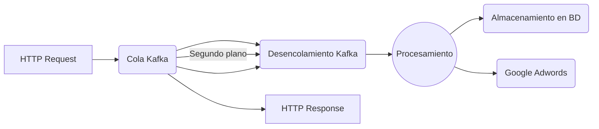

# Vendor Campaign Creator

Este microservicio extrae tiendas y su información básica, después crea las campañas necesarias dentro de Google Adwords. Cada campaña incluye _ad groups_, anuncios, palabras clave y ubicaciones.

## Prerequisitos

1.  Docker
2.  Python 3.7
3.  Usuario de snowflake
4.  Acceso a Google Adwords

## Tecnologías

-   Python
-   PostgreSQL

## ¿Cómo funciona?

El ms recibe las peticiónes a base de una cola en Kafka. Esta cola es después procesada por las diferentes instancias, de esta forma evitando un desbordamiento y exceso de uso en los recursos.

Gracias al sistema de encolamiento de Kafka cada mensaje puede ser procesado de forma paralela. Buscando la información de cada tienda y cargando los datos necesarios dentro de la plataforma de Google Adwords.

## Instalación

### Creando un usuario de Snowflake

Es importante contar con el acceso a Snowflake primero. Para hacer esto, debes de levantar dos tickets llenando el siguiente formulario: _[link]() esto le dará acceso a tu usuario de Rappi a Snowflake._ [link]() esto habilitará el SSO para tu usuario de Rappi en Snowflake.

### Variables de entorno

##### Google Credentials

-   GOOGLE_PRIVATE_KEY
-   GOOGLE_CLIENT_EMAIL
-   GOOGLE_TOKEN_URI
-   GOOGLE_ADWORDS_DEVELOPER_TOKEN
-   GOOGLE_ADWORDS_CLIENT_ID
-   GOOGLE_ADWORDS_CLIENT_SECRET
-   GOOGLE_ADWORDS_REFRESH_TOKEN
-   GOOGLE_ADWORDS_LOGIN_CUSTOMER_ID
-   GOOGLE_ADWORDS_API_ENABLED_BY_COUNTRIES=UY,EC,CR,CL,AR,PE,MX,BR,CO //  _Possible values: List of countries where you want to create campaigns_
-   GOOGLE_HEADLINE_LINE_LIMIT=30
-   GOOGLE_DESCRIPTION_LINE_LIMIT=90
-   GOOGLE_PATH_LINE_LIMIT=15
-   BUDGET_BIDDING_INPUT_DIR_ID

##### PG Credentials (valores para pruebas locales)

-   DB_GROWTH_SEM_AUTOMATION_USER=postgres
-   DB_GROWTH_SEM_AUTOMATION_PASSWORD=postgres
-   DB_GROWTH_SEM_AUTOMATION_DATABASE=growth_sem_automation
-   DB_GROWTH_SEM_AUTOMATION_PORT=5432
-   DB_GROWTH_SEM_AUTOMATION_HOST=localhost

##### S3 Credentials

-   AWS_ACCESS_KEY_ID
-   AWS_SECRET_ACCESS_KEY
-   AWS_BUCKET
-   AWS_DESTINATION_PATH
-   AWS_COUNTRY_FOLDER=dev

##### Snowflake Credentials

-   SNOWFLAKE_DB_ACCOUNT
-   SNOWFLAKE_DB_USER
-   SNOWFLAKE_DB_PASSWORD
-   SNOWFLAKE_DB_DATABASE

##### Kafka settings

-   KAFKA_HOST
-   KAFKA_CONSUMER

Importante para las pruebas:

-   No te olvides de asignar el valor a AWS_COUNTRY_FOLDER de 'dev'. Esto significa que utilizarás la información de dev para llenar las bases de datos.
-   Para probar con tu usuario personal de snowflake agrega el parámetro _authenticator='externalbrowser'_ a la función de conección en el archivo 'src/persistence/snowflake_database_client.py'

### Docker Compose para desarrollo

docker-compose up # Inicia los servicios. Usa Ctrl + C para detenerlo cuando sea necesario.
docker-compose up -d # Corre el servicio en un segundo plano
docker-compose down # Para detener todos los servicios "-d"

## Corriendo la aplicación

1. Inicializa las variables de entorno antes mencionadas, preguntale a tu equipo por las credenciales.
2. Ejecuta `docker run --name pgsem -e POSTGRES_PASSWORD=postgres -e POSTGRES_USER=postgres -e POSTGRES_DB=growth_sem_automation -p 5432:5432 -d postgres:9.6.6-alpine` para compilar y correr la imagen de PostgresSQL.
3. Ejecuta `docker-compose up` para inicializar Kafka.
4. Ejecuta `python3 server.py` para iniciar el servidor.
5. Para probar el API ejecuta `curl --location --request GET 'http://localhost:8085/api/ms/growth-sem-automation/health-check'`. Debería de retornar `HTTP/1.1 200 OK`

## Migraciones

Para agregar una migración, tu **debes** de mantener el conteo

## API Endpoints

En _[este link]()_ podrás leer toda la documentación relacionada a los endpoints.

## Tests

Desde la carpeta raiz del proyecto ejecuta: `pytest src/tests/`

## Contribuyentes

-   david.ortiz@rappi.com
-   laura.bello@rappi.com
-   mariano.perez@rappi.com
-   mike.olivera@rappi.com
-   yascorve@rappi.com
-   icabo@rappi.com
